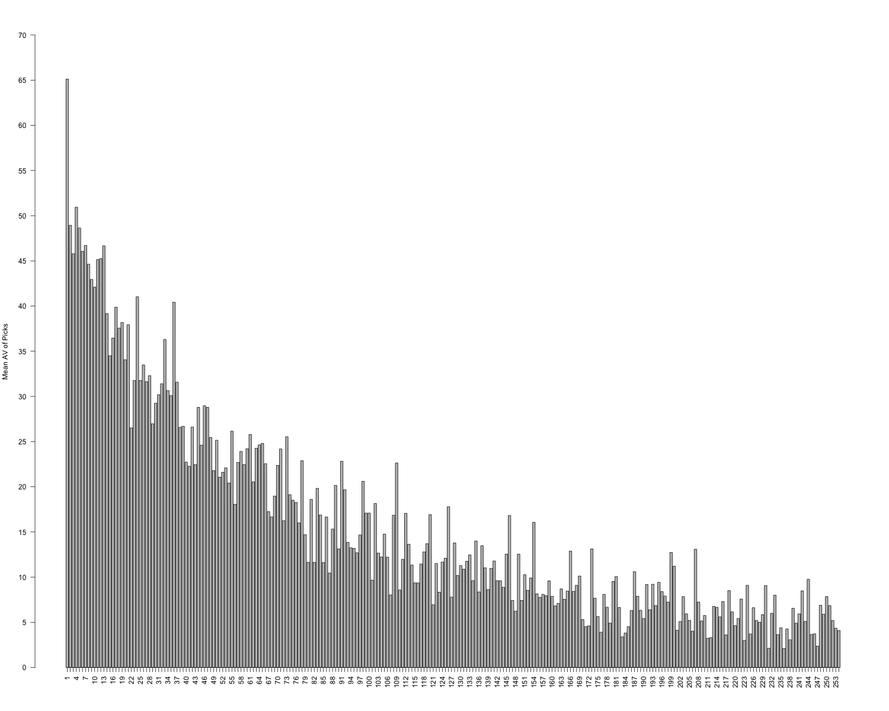

# Drafting The Best Alternative

### Impetus
Tom Brady was drafted in 2000 after such players as Giovanni Carmazzi and Tee Martin. While there were great players in the 2000 draft class (Brian Urlacher and Shaun Alexander, for example), I think it is reasonable to suggest that almost every team would go back and take Brady if they could get a redo. While he may be an extreme outlier, it raises the question of how often teams make the correct choice within a set of constrained alternatives. By that I mean, it is worthwhile to consider how draftees are evaluated compared to the next alternative within their position. For instance, the Chicago Bears have a high stakes choice to make with the first pick of the 2024 draft in which they will surely take a quarterback. No disrespect to players like Marvin Harrison Jr., but the Bears' choice is really constrained to the available QB candidates. 

### Approach
This project looks at how good of a job NFL teams do at drafting players within the same position. It makes some strong assumptions about how drafting works, but the essential idea is as follows:
- Teams evaluate draftees relative to their positional comparisons (WRs are compared to other WRs, for example).
- When a team makes a decision to draft a player, the available options for that selection are all of the players in the draft who play that position (if a team is taking a TE with the 45th pick, they are selecting from all available tight ends left in the draft class).
- When a team drafts a player, I treat them as if they stay on the same team for their entire career (this is obviously incorrect but post-draft contracts and player moves is beyond the scope of this project).

These assumptions aren't fully backed up in reality, of course. Sometimes teams will draft the best available player regardless of position. While this approach does not account for that, I think it is a somewhat reasonable assumption to make that, in general, players are drafted based on need at that position.

### Data
Data for this project comes for www.pro-football-reference.com (PFR). I collected each draft list from 1990 - 2022 (more recent drafts have players too early in their careers to effectively answer these questions, I think) resulting in 8,581 players. Each draft file includes the draft order, player drafted for each pick, the position they play(ed), and their career statistics. There are discrepancies in how players are listed to the data is cleaned as follows:
- All CBs become DBs
- All OTs become Ts
- All KRs become WRs
- ~30 players with DT/DE position listings are corrected to their player listing in PFR.
- ~109 players with OL position listings are corrected to their player listing in PFR. Some of these are a little tricky as they either didn't play a game or swapped around positions. For these, I use the position they are listed as being drafted in. That isn't perfect but it is one way to easily handle the nature of offensive line players. Two players had no listing beyond OL in PFR. For those I simply searched for what their position is listed at in Wikipedia.
- Teams are updated to reflect their *current* team (e.g. the Raiders are the Las Vegas Raiders for all drafts).
- All drafts stop after the 254th pick. There are 283 players drafted after the 254th pick across all of the drafts, but the low numbers for each pick skews our data so I removed them. This leaves us with 8,298 players.

#### Approximate Value of Players
To find the value of each pick I used one of two measures from PFR: AV and wAV. The description of them is here: https://www.pro-football-reference.com/about/approximate_value.htm. Put simply, they are measures of the total "value" that the player's career had. AV is the raw number and wAV is a weighted measure of AV that discounts the value of each year. Crucially, I take the *higher* of these two numbers for each player. The rationale is two-fold. The first is that not every player has a metric for each value and taking the higher generally accounts for that. The second is that I am trying to be as generous as possible to teams while using an imprecise tool. Players without an AV or wAV score are listed as having a career AV of 0. Going forward, I will refer to the player's AV with the understanding that it means the higher of their AV and wAV.

The main variable of interest is what I call NAV (or Next Alternative Value). NAV is the difference between the AV of the player drafted and the AV of the next player that was drafted in the same position after them. For example, in 1996 the New York Jets selected Keyshawn Johnson (WR) with the first pick of the draft and an AV of 79. The next WR taken was Terry Glenn at 7. Johnson's NAV is his 79 minus Glenn's 67, resulting in a NAV of 12 for Johnson. Essentially, the Jets gained 12 AV points by picking Johnson over Glenn. This approach does preclude the possibility that a player drafted later has a better career. This undoubtedly happens, but my approach is meant to be a little more generous to teams by allowing for the fact that the next player drafted a closer fit to the selection than those drafted much later.  

### Findings
TLDR: Teams are generally pretty good at drafting the better player.

I look at this in a few different ways. The first is simply looking at how each team did over those drafts as both a raw number of added value and a mean added value. These are Figures 1 and 2 below. In both plots there is a gray line at 0 (teams below that line are pretty bad at drafting players) and a red line at the median NAV for that dataset (total NAV and mean NAV respectively).

##### FIGURE 1: Total NAV Per Team

  

Here we see that, generally speaking, most teams have a positive NAV score in both total NAV (summed over 33 drafts) and their mean NAV across their picks. Teams above the red line are excellent at correctly picking the better player between two options. Teams that have historically been successful on the field during our window tend to be better at drafting (Green Bay, Indianapolis, Baltimore, New England). Teams between the red and gray lines are able to correctly identify the better player between two choices but are not doing so as well as those above. Teams below the gray line, Cleveland, Cincinnati, Las Vegas, Philadelphia, and Carolina, are pretty bad at drafting over our window. Essentially, those teams are consistently picking the player who has a worse career between the two choices.

##### FIGURE 2: Mean NAV Per Team

  

The final component of team drafting that I look at is how well teams draft both sides of the ball (sorry special teamers). Figure 3 shows the mean NAV for each team for their defensive draftees and their offensive draftees with a grey dashed line indicating a perfect 1:1 ratio of offensive and defensive drafting success. Results are fairly consistent with what we might expect looking at history. For instance, New Orleans is rather good at drafting offensive players but struggles mightily with drafting effective defensive prospects. Cleveland is bad at everything. Pittsburgh has had success on both sides of the ball.

##### FIGURE 3: Mean NAV Per Team by Offensive and Defensive Draftees

  

That is not to say drafting is the end all of success. Multiple teams who are okay or even borderline bad at drafting still have success and can win Super Bowls. The results here are confined to considering draft ability, not the translation to actually winning games.

#### The Best and Worst Picks to Have
I also wanted to look the pick positions themselves to see if there is anything interesting going on. First, I just look at the mean AV for each pick slot. Figure 4 below shows the results across the 33 drafts. Unsurprisingly, the first pick has the best AV of all of them. On average, drafting first gets you a really good player. Generally speaking, this holds true for most picks. As you get further down in the draft, the AV of each pick decreases.

##### FIGURE 4: Mean AV Per Pick

  

Still, there are interesting results in here. I want to zoom in on the first part of the draft to highlight a couple of these. Figure 5 is the same results but for just the first two rounds (top-64 picks). Some picks stand out as being notably worse than others, especially the 22nd pick. In addition, the 4th pick is producing notably less value than those surrounding it.

##### FIGURE 5: Mean AV Per Pick (First Two Rounds)

  

#### NAV By Position
The next set of analyses is focused on what positions teams are good at drafting. For this, I take the average NAV for each position across all teams. Figure 6 shows the results below broken up by offensive players, defensive players, and special team picks. Nose Tackles are, by far, the position with the highest NAV at 13.1, with more than double the next highest (centers at 6.32). QBs are also highly placed at 5.05 average NAV. On the other end of the spectrum, teams are not good at drafting players in the secondary positions (defensive backs and safeties).  

##### FIGURE 6: Mean NAV By Postion

  

#### The Worst Draft Pick Ever
This won't be a surprise to anyone who has a decent understanding of draft history. It's Spergon Wynn, who was drafted 16 spots before Tom Brady and cost Cleveland 182 AV points. The list is rounded out with some other unsurpising picks for those who follow football closely.

##### TABLE 1: Worst NAV Picks Across All Drafts
| Player | AV | Next Player | Next Player AV | NAV |
| --------------- | :------------: | --------------- | :-------------: | :-------------: |
| Spergon Winn | 2 | Tom Brady | 184 | -182 |
| Todd Marinovich | 3 | Brett Favre | 158 | -155 |
| Reggie Brown | 11 | Ray Lewis | 160 | -149 |
| Coleman Rudolph | 6 | Michael Strahan | 122 | -116 |
| Brock Osweiler | 14 | Russell Wilson | 130 | -116 |

#### The Best Draft Pick Ever (besides Tom Brady)
Unsurprisingly, again, the best picks are dominated by QBs. Peyton Manning, Brett Favre, and Drew Brees round out the top 4 along with Brady, all adding value of over 140 points to their teams. 

##### TABLE 2: Best NAV Picks Across All Drafts
| Player | AV | Next Player | Next Player AV | NAV |
| --------------- | :------------: | --------------- | :-------------: | :-------------: |
| Tom Brady | 184 | Todd Husak | 0 | 184 |
| Peyton Manning | 176 | Ryan Leaf | 1 | 175 |
| Brett Favre | 158 | Browning Nagle | 5 | 153 |
| Drew Brees| 167 | Qunicy Carter | 16 | 151 |
| Derrick Brooks | 142 | Craig Powell | 0 | 142 |

Of course, the "best" pick here is who had the best career over their alternative. Plenty of players had excellent careers but so did their counterpart, resulting in a lower NAV. For instance, Philip Rivers and Ben Roethlisberger have the highest combined AV scores over 33 years of drafting at 280 points but Rivers (drafted ahead of Roethlisberger) only gets a NAV of 18. Alex Smith and Aaron Rodgers are also up there with 261 points of AV, but Smith gets a NAV of -65 despite having a relatively successful career. In fact, Smith has the 96th *worst* NAV across all 8,298 players.

##### TABLE 3: Highest Combined AV Picks Across All Drafts
| Player | AV | Next Player | Next Player AV | NAV | Total AV
| --------------- | :------------: | --------------- | :-------------: | :-------------: | :-------------: |
| Philip Rivers | 149 | Ben Roethlisberger | 131 | 18 | 280 |
| Eli Manning | 121 | Philip Rivers | 149 | -28 | 270 |
| Alex Smith | 98 | Aaron Rodgers | 263 | -65 | 261 |
| Michael Vick | 92 | Drew Brees | 167 | -75 | 259 |
| Matt Ryan | 146 | Joe Flacco | 93 | 53 | 239 |

#### The Best and Worst Schools to Draft From
Who doesn't love healthy trash talk between rival schools? In addition to looking at picks and teams, I wanted to see if teams are potentially relying on school reputation or on-field success instead of player ability. While this won't fully answer this question, it does provide some interesting comparisons. To start, I drop any school that doesn't have at least 4 players drafted over the last 33 years, a fairly generous window. It also helpfully reduces our school count from 371 to 189.

The best school for NAV? Harvard, with a mean NAV of 34.4 (predominantly driven by Matt Birk and Ryan Fitzpatrick). That being said, there are only 5 Harvard draftees in the data. Among schools with a decently large number of drafted players, Marshall (with 23 draftees and a mean NAV of 12.56) and Boston College (64 draftees and mean NAV of 10.5) stand out.

The worst schools include some lesser-known institutions, like Texas State at -29.37 among its 8 draftees and Kansas, whose 34 draftees have a mean NAV of -5.41. Even among those schools with a large number of players drafted, results aren't always encouraging. Ohio State leads the drafted count with 202 players, but they only provide an average NAV of 0.72 whereas Alabama's 179 players (second most) have a NAV of 2.33. Bragging rights also are owned by Florida, who come in tied for 3rd with FSU at 177 draftees each but possess a much stronger NAV at 2.14 versus FSU's ... less than excellent ... -1.27.

Figure XXXX shows the breakdowns by school, though given the number the x-axis is limited in what it shows. Table 4 shows some of the "best" and "worst" schools to draft from. It is notable that some of the lowest performing schools are also some of the best on-field college teams over the last 30+ years. It suggests that there may be an implicit bias among draft evaluators towards college success that doesn't strictly translate to the professional game.

##### FIGURE 5: Mean AV Per Pick (First Two Rounds)

  

##### TABLE 4: Notable College Teams by NAV
| Player | AV | Next Player | Next Player AV | NAV | Total AV
| --------------- | :------------: | --------------- | :-------------: | :-------------: | :-------------: |
| Philip Rivers | 149 | Ben Roethlisberger | 131 | 18 | 280 |
| Eli Manning | 121 | Philip Rivers | 149 | -28 | 270 |
| Alex Smith | 98 | Aaron Rodgers | 263 | -65 | 261 |
| Michael Vick | 92 | Drew Brees | 167 | -75 | 259 |
| Matt Ryan | 146 | Joe Flacco | 93 | 53 | 239 |

### Takeaways
As I mentioned up at the top of Findings, most teams are pretty good at evaluating talent. While it is clearly hard and there are a lot of misses, generally speaking a lot of teams are at least able to correctly gauge who is the overall better player. However, there are also major areas where draft evaluators could improve. Some picks are "worth" less than others with the 4th pick really standing out as a place where trading out of the position ought to be strongly considered. 

